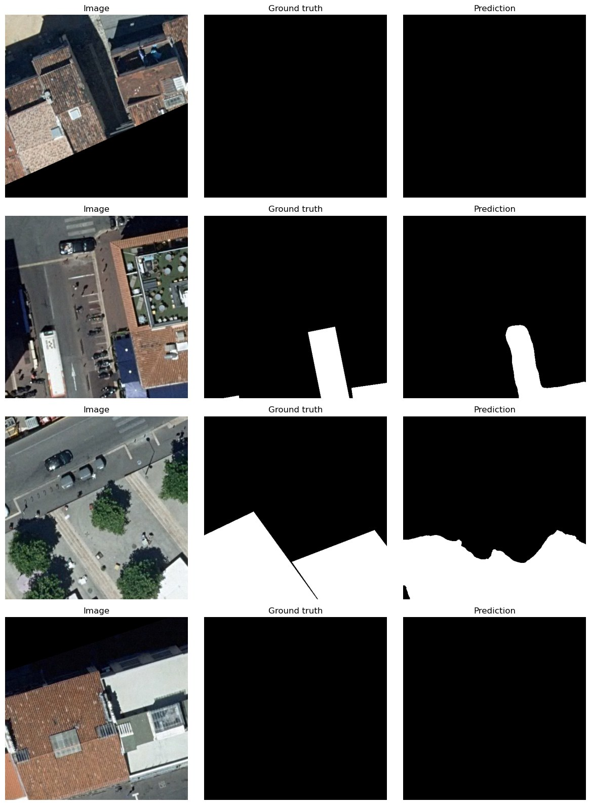
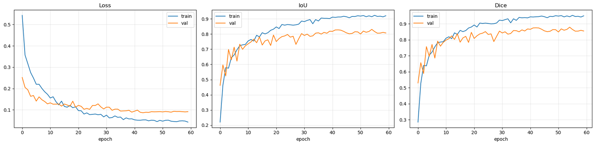
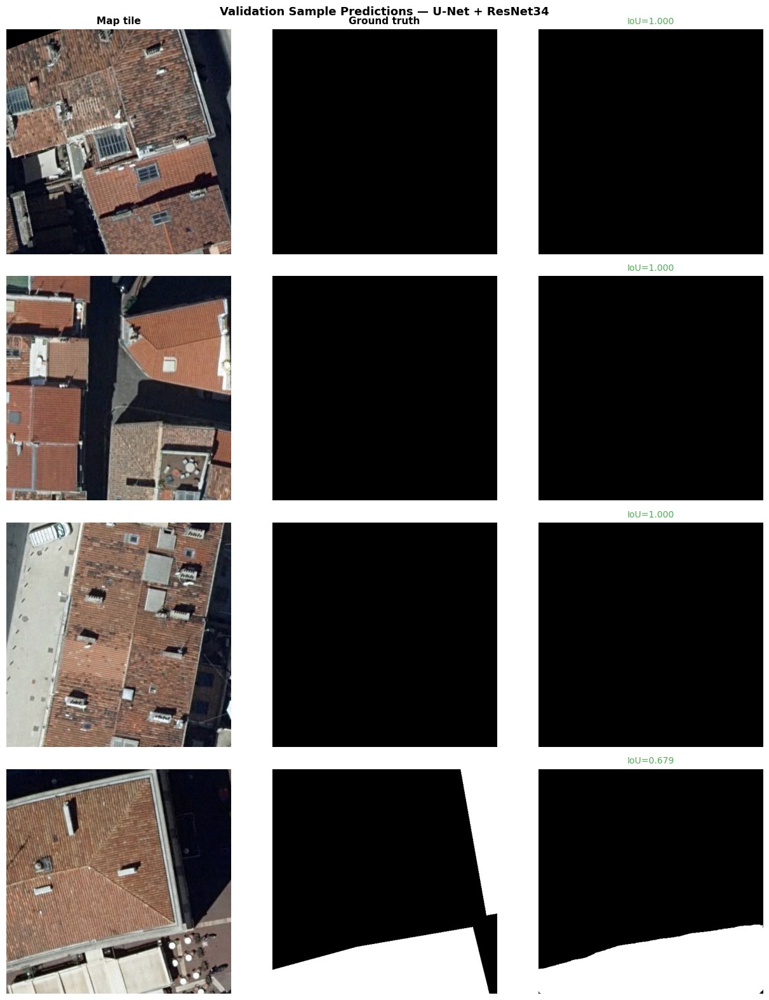

# Aerial Terrace Segmentation

Semantic segmentation of building terraces from aerial orthophotos, developed during a
computer-vision internship at the *Direction des Systemes d'Information* (DSI) of the
City of Marseille. The goal is to automatically detect terrace surfaces in high-resolution
aerial imagery and export the results as geo-referenced masks that align with the source
imagery in a GIS (QGIS).

The repository contains two self-contained training and inference pipelines:

| Notebook | Model | Best Val IoU | Best Val Dice |
|----------|-------|:------------:|:-------------:|
| [`01_segformer_mit_b3.ipynb`](notebooks/01_segformer_mit_b3.ipynb) | SegFormer (MiT-B3 encoder) | **0.83** | **0.88** |
| [`02_unet_three_approaches.ipynb`](notebooks/02_unet_three_approaches.ipynb) | U-Net / U-Net+ResNet34 / Attention U-Net | see notebook | see notebook |

SegFormer (MiT-B3) was the strongest single model and is the one used in production inference.

---

## Results

### SegFormer (MiT-B3)

Left to right: input tile, ground-truth mask, model prediction.





### U-Net architecture comparison

Three architectures trained under identical conditions on the same dataset. The
ImageNet-pretrained ResNet-34 encoder converged fastest and gave the best validation IoU
among the U-Net family.




---

## Approach

### Data
- Input: 512x512 GeoTIFF tiles (RGB) cut from aerial orthophotos, with matching binary
  terrace masks (`terrace` / `background`).
- Tiles that are not exactly 512x512 are filtered out to keep map/mask pairs synchronized.
- 80/20 train/validation split with a fixed seed for reproducibility.

### Notebook 1 - SegFormer (MiT-B3)
- SegFormer decoder with a Mix Transformer (MiT-B3) encoder pretrained on ImageNet, via
  [`segmentation_models_pytorch`](https://github.com/qubvel/segmentation_models.pytorch).
- Loss: combined Dice + BCE (0.5 / 0.5).
- Optimizer: AdamW with cosine-annealing schedule; automatic mixed precision (AMP) on GPU.
- Augmentation tuned for aerial imagery: flips, 90-degree rotations, small affine transforms,
  brightness/contrast jitter, light Gaussian blur.
- The best checkpoint (by validation IoU) is saved and reloaded for inference.

### Notebook 2 - U-Net, three approaches
Three architectures compared on the same data and metrics:

1. **Vanilla U-Net** - trained from scratch (BatchNorm double-conv blocks, BCE+Dice loss,
   Adam, ReduceLROnPlateau).
2. **U-Net + ResNet-34 encoder** - ImageNet-pretrained encoder, Focal+Dice loss, AdamW,
   cosine annealing.
3. **Attention U-Net** - soft attention gates (Oktay et al., 2018) to suppress irrelevant
   regions, trained from scratch.

Each model is checkpointed on best validation IoU; the winner is selected automatically and
used for inference.

### Inference
- Runs on a folder of unseen `.tif` tiles.
- Corrupt or wrongly sized tiles are detected and skipped rather than crashing the batch.
- Each predicted mask keeps the CRS and affine transform of its input tile, so predictions
  overlay the source imagery correctly in QGIS.

---

## Repository structure

```
aerial-terrace-segmentation/
├── notebooks/
│   ├── 01_segformer_mit_b3.ipynb        # SegFormer training + inference
│   └── 02_unet_three_approaches.ipynb   # 3-architecture comparison + inference
├── assets/                              # result figures used in this README
├── requirements.txt
├── LICENSE
└── README.md
```

---

## Setup

```bash
git clone https://github.com/<your-username>/aerial-terrace-segmentation.git
cd aerial-terrace-segmentation

python -m venv .venv
source .venv/bin/activate        # Windows: .venv\Scripts\activate

# Install PyTorch for your platform first (see https://pytorch.org):
pip install torch torchvision

pip install -r requirements.txt
```

Then open either notebook in Jupyter or VS Code, set the dataset paths in the configuration
cell (`MAP_DIR`, `MASK_DIR`, and the unseen-tiles directory), and run the cells in order.

---

## Data availability

The aerial orthophotos and hand-labelled terrace masks were produced during the internship
and belong to the City of Marseille DSI. They are **not** included in this repository, and
neither are the trained model weights. The result figures above are provided only to
illustrate model behaviour. To reproduce the pipeline, supply your own set of paired
512x512 GeoTIFF tiles and masks and point the configuration cells at them.

---

## Tech stack

Python, PyTorch, segmentation-models-pytorch, timm, Albumentations, Rasterio, NumPy,
scikit-learn, Matplotlib.

## License

Code released under the [MIT License](LICENSE). The dataset and trained weights are not
covered by this license and are not distributed.
